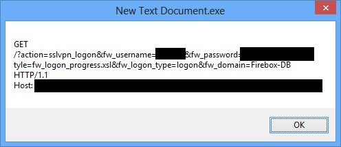

# WatchOut
Recover WatchGuard Mobile VPN logon information from the process memory dump

## How to use
* Run executable file.
* If everything goes well, message box will pop up and display the logon information.

## Screenshot

